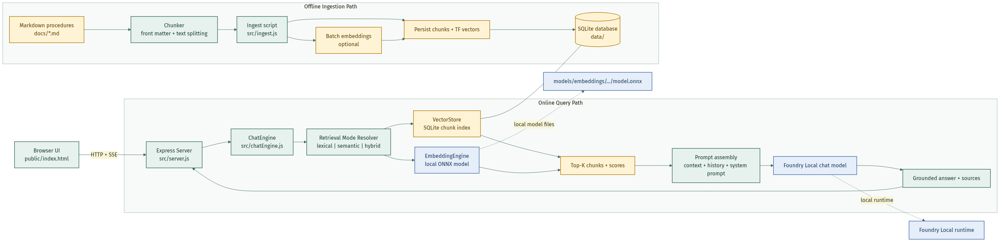

# Local Hybrid Retrival ONNX

Offline hybrid RAG sample based on the original local-rag project.

This repository is prepared for public source sharing as a standalone folder. Local models, generated SQLite data, dependencies, and environment files are intentionally excluded from version control.

This version keeps the existing lexical term-frequency retrieval path and adds local ONNX embeddings for semantic retrieval. At runtime you can choose:

- lexical: exact-term retrieval only
- semantic: embedding similarity only
- hybrid: lexical plus semantic fusion

If the embedding model is missing or fails to load, the app falls back to lexical retrieval automatically.

## What Changed

- Added a local embedding pipeline in src/embeddingEngine.js using Transformers.js and ONNX Runtime.
- Extended the SQLite vector store to persist both sparse lexical features and dense embedding vectors.
- Added semantic and hybrid search methods alongside the original lexical path.
- Updated ingestion so document chunks get embeddings when a local model is available.
- Added a retrieval mode selector to the UI.

## Project Layout

- src/embeddingEngine.js: loads a local ONNX embedding model and produces normalized vectors
- src/vectorStore.js: stores TF maps plus optional embedding vectors and performs lexical, semantic, or hybrid ranking
- src/chatEngine.js: resolves retrieval mode, applies lexical fallback, and passes retrieved context to Foundry Local
- src/ingest.js: indexes markdown docs into SQLite and computes embeddings when available
- src/server.js: exposes chat, upload, health, and status endpoints for the hybrid app

## Architecture



The Mermaid source for this diagram lives in docs/architecture.mmd.

## Prerequisites

- Node.js 20 or newer
- Foundry Local installed for the chat model
- A local ONNX embedding model directory

Recommended layout:

```text
local-hybrid-retrival-onnx/
  models/
    embeddings/
      bge-small-en-v1.5/
        config.json
        tokenizer.json
        tokenizer_config.json
        onnx/
          model.onnx
```

By default the app looks for the embedding model at models/embeddings/bge-small-en-v1.5.

You can override that with an environment variable:

```powershell
$env:EMBEDDING_MODEL_PATH = "C:\path\to\your\embedding-model"
```

## Install

```powershell
cd c:\Users\leestott\local-hybrid-retrival-onnx
npm install
```

## Public Repo Notes

- `models/` is ignored because embedding weights are large local assets and may be subject to separate distribution terms.
- `data/` is ignored because `npm run ingest` creates the local SQLite index on each machine.
- `.env*` is ignored so machine-specific settings do not leak into the public repository.
- `node_modules/` is ignored and should be recreated with `npm install`.

## Required Local Models

The embedding model is not included in the repository because model weights are large and may carry separate distribution terms. To enable semantic and hybrid retrieval on a fresh clone:

1. Download **BGE-small-en-v1.5** in ONNX format from Hugging Face:

   ```powershell
   # Using the Hugging Face CLI (pip install huggingface-hub)
   huggingface-cli download BAAI/bge-small-en-v1.5 --local-dir models/embeddings/bge-small-en-v1.5
   ```

2. Verify the expected file layout:

   ```text
   models/embeddings/bge-small-en-v1.5/
     config.json            (~743 B)
     tokenizer.json         (~695 KB)
     tokenizer_config.json  (~366 B)
     onnx/
       model.onnx           (~127 MB)
   ```

3. Alternatively, point to any Transformers.js-compatible ONNX model directory:

   ```powershell
   $env:EMBEDDING_MODEL_PATH = "C:\path\to\your\embedding-model"
   ```

If the model is absent or fails to load, the app still works using lexical-only retrieval.

You can verify model availability after starting the server by checking the `/api/health` endpoint, which lists the embedding model files it found.

## Ingest Documents

```powershell
npm run ingest
```

If the ONNX embedding model is available, ingestion stores both lexical features and dense vectors.
If not, ingestion still completes and indexes lexical features only.

## Run

```powershell
npm start
```

Open http://127.0.0.1:3000.

The header includes a retrieval mode selector:

- Hybrid when embeddings are available
- Semantic when embeddings are available
- Lexical always available

## Retrieval Behavior

### Lexical

- Fastest path
- Best for exact names, codes, acronyms, and repeated domain terminology
- No synonym understanding

### Semantic

- Uses local ONNX embeddings for query-to-chunk similarity
- Better for paraphrases and synonym-heavy queries
- Requires the embedding model to be present locally

### Hybrid

- Combines lexical and semantic scores
- Usually the best default for mixed workloads
- Falls back to lexical if semantic retrieval is unavailable

## Configuration

The main retrieval settings live in src/config.js:

- RETRIEVAL_MODE: lexical, semantic, or hybrid
- EMBEDDING_MODEL_PATH: local path to the ONNX embedding model directory
- retrievalWeights: score weights for lexical and semantic fusion

## Tests

```powershell
npm test
```

The tests cover lexical behavior plus semantic and hybrid ranking logic in the local vector store.
