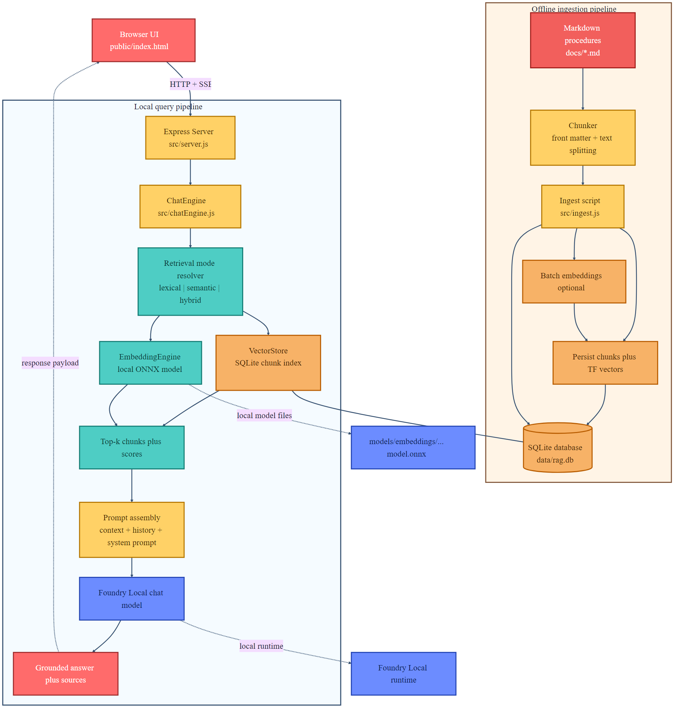
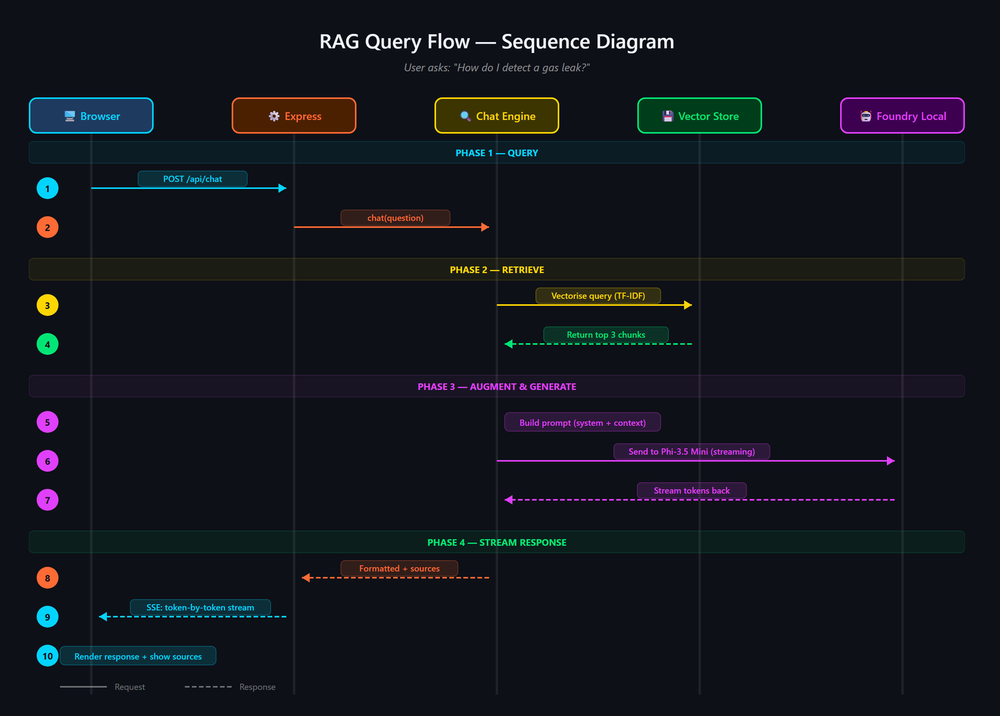
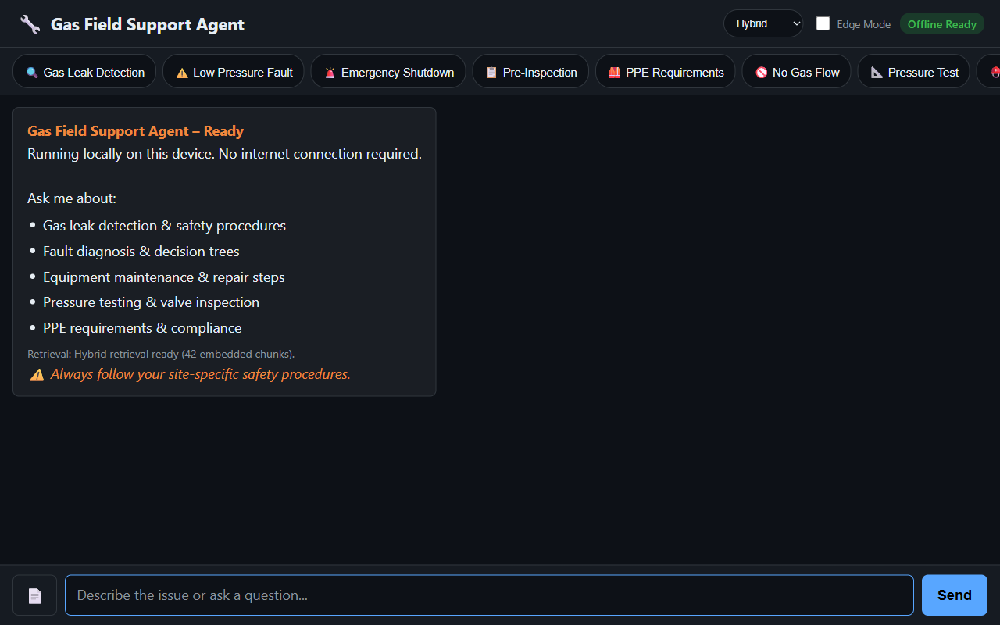
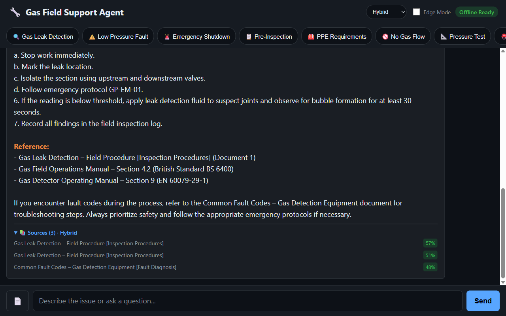

# Build an Offline Hybrid RAG Stack with ONNX and Foundry Local

Audience: AI Engineers and Developers  
Reading time: 10 to 15 minutes

If you are building local AI applications, basic retrieval augmented generation is often only the starting point. This sample shows a more practical pattern: combine lexical retrieval, ONNX based semantic embeddings, and a Foundry Local chat model so the assistant stays grounded, remains offline, and degrades cleanly when the semantic path is unavailable.

## Why this sample is worth studying

Many local RAG samples rely on a single retrieval strategy. That is usually enough for a proof of concept, but it breaks down quickly in production. Exact keywords, acronyms, and document codes behave differently from natural language questions and paraphrased requests.

This repository keeps the original lexical retrieval path, adds local ONNX embeddings for semantic search, and fuses both signals in a hybrid ranking mode. The generation step runs through Foundry Local, so the entire assistant can remain on device.

- Lexical mode handles exact terms and structured vocabulary.
- Semantic mode handles paraphrases and more natural language phrasing.
- Hybrid mode combines both and is usually the best default.
- Lexical fallback protects the user experience if the embedding pipeline cannot start.

## Architectural overview

The sample has two main flows: an offline ingestion pipeline and a local query pipeline.



The architecture splits cleanly into offline ingestion at the top and runtime query handling at the bottom.

### Offline ingestion pipeline

1. Read Markdown files from `docs/`.
2. Parse front matter and split each document into overlapping chunks.
3. Generate dense embeddings when the ONNX model is available.
4. Store chunks in SQLite with both sparse lexical features and optional dense vectors.

### Local query pipeline

1. The browser posts a question to the Express API.
2. `ChatEngine` resolves the requested retrieval mode.
3. `VectorStore` retrieves lexical, semantic, or hybrid results.
4. The prompt is assembled with the retrieved context and sent to a Foundry Local chat model.
5. The answer is returned with source references and retrieval metadata.



The sequence diagram shows the difference between lexical retrieval and hybrid retrieval. In hybrid mode, the query is embedded first, then lexical and semantic scores are fused before prompt assembly.

## Repository structure and core components

The implementation is compact and readable. The main files to understand are listed below.

- `src/config.js`: retrieval defaults, paths, and model settings.
- `src/embeddingEngine.js`: local ONNX embedding generation through Transformers.js.
- `src/vectorStore.js`: SQLite storage plus lexical, semantic, and hybrid ranking.
- `src/chatEngine.js`: retrieval mode resolution, prompt assembly, and Foundry Local model execution.
- `src/ingest.js`: document ingestion and embedding generation during indexing.
- `src/server.js`: REST endpoints, streaming endpoints, upload support, and health reporting.

## Getting started

To run the sample, you need Node.js 20 or newer, Foundry Local, and a local ONNX embedding model. The default model path is `models/embeddings/bge-small-en-v1.5`.

```powershell
cd c:\Users\leestott\local-hybrid-retrival-onnx
npm install

huggingface-cli download BAAI/bge-small-en-v1.5 --local-dir models/embeddings/bge-small-en-v1.5

npm run ingest
npm start
```

Ingestion writes the local SQLite database to `data/rag.db`. If the embedding model is available, each chunk gets a dense vector as well as lexical features. If the embedding model is missing, ingestion still succeeds and the application remains usable in lexical mode.

> Best practice: local AI applications should treat model files, SQLite data, and native runtime compatibility as part of the deployable system, not as optional developer conveniences.

## Code walkthrough

### 1. Retrieval configuration

The sample makes its retrieval behaviour explicit in configuration. That is useful for testing and for operator visibility.

```js
export const config = {
  model: "phi-3.5-mini",
  docsDir: path.join(ROOT, "docs"),
  dbPath: path.join(ROOT, "data", "rag.db"),
  chunkSize: 200,
  chunkOverlap: 25,
  topK: 3,
  retrievalMode: process.env.RETRIEVAL_MODE || "hybrid",
  retrievalModes: ["lexical", "semantic", "hybrid"],
  fallbackRetrievalMode: "lexical",
  retrievalWeights: {
    lexical: 0.45,
    semantic: 0.55,
  },
};
```

Those defaults tell you a lot about the intended operating profile. Chunks are small, the number of returned chunks is low, and the fallback path is explicit.

### 2. Local ONNX embeddings

The embedding engine disables remote model loading and only uses local files. That matters for privacy, repeatability, and air gapped operation.

```js
env.allowLocalModels = true;
env.allowRemoteModels = false;

this.extractor = await pipeline("feature-extraction", resolvedPath, {
  local_files_only: true,
});

const output = await this.extractor(text, {
  pooling: "mean",
  normalize: true,
});
```

The mean pooling and normalisation step make the vectors suitable for cosine similarity based ranking.

### 3. Hybrid storage and ranking in SQLite

Instead of adding a separate vector database, the sample stores lexical and semantic representations in the same SQLite table. That keeps the local footprint low and the implementation easy to debug.

```js
searchHybrid(query, queryEmbedding, topK = 5, weights = { lexical: 0.45, semantic: 0.55 }) {
  const lexicalResults = this.searchLexical(query, topK * 3);
  const semanticResults = this.searchSemantic(queryEmbedding, topK * 3);

  if (semanticResults.length === 0) {
    return lexicalResults.slice(0, topK).map((row) => ({
      ...row,
      retrievalMode: "lexical",
    }));
  }

  const fused = [...combined.values()].map((row) => ({
    ...row,
    score: (row.lexicalScore * lexicalWeight) + (row.semanticScore * semanticWeight),
  }));

  fused.sort((a, b) => b.score - a.score);
  return fused.slice(0, topK);
}
```

The important point is not just the weighted fusion. It is the fallback behaviour. If semantic retrieval cannot provide results, the user still gets lexical grounding instead of an empty context window.

### 4. Retrieval mode resolution in ChatEngine

`ChatEngine` keeps the runtime behaviour predictable. It validates the requested mode and falls back to lexical search when semantic retrieval is unavailable.

```js
resolveRetrievalMode(requestedMode) {
  const desiredMode = config.retrievalModes.includes(requestedMode)
    ? requestedMode
    : config.retrievalMode;

  if ((desiredMode === "semantic" || desiredMode === "hybrid") && !this.semanticAvailable) {
    return config.fallbackRetrievalMode;
  }

  return desiredMode;
}
```

This is a sensible production design because local runtime failures are common. Missing model files or native dependency mismatches should reduce quality, not crash the entire assistant.

### 5. Foundry Local model management

The sample uses `FoundryLocalManager` to discover, download, cache, and load the configured chat model.

```js
const manager = FoundryLocalManager.create({ appName: "gas-field-local-rag" });
const catalog = manager.catalog;

this.model = await catalog.getModel(config.model);

if (!this.model.isCached) {
  await this.model.download((progress) => {
    const pct = Math.round(progress * 100);
    this._emitStatus("download", `Downloading ${this.modelAlias}... ${pct}%`, progress);
  });
}

await this.model.load();
this.chatClient = this.model.createChatClient();
this.chatClient.settings.temperature = 0.1;
```

This gives the app a better local startup experience. The server can expose a status stream while the model initialises in the background.

## User experience and screenshots

The client is intentionally simple, which makes it useful during evaluation. You can switch retrieval mode, test questions quickly, and inspect the retrieved sources.



The landing page exposes retrieval mode directly in the UI. That makes it easy to compare lexical, semantic, and hybrid behaviour during testing.



The sources panel shows grounding evidence and retrieval scores, which is useful when validating whether better answers are coming from better retrieval or just model phrasing.

## Best practices for ONNX RAG and Foundry Local

- Keep lexical fallback alive. Exact identifiers and runtime failures both make this necessary.
- Persist sparse and dense features together where possible. It simplifies debugging and operational reasoning.
- Use small chunks and conservative `topK` values for local context budgets.
- Expose health and status endpoints so users can see when the model is still loading or embeddings are unavailable.
- Test retrieval quality separately from generation quality.
- Pin and validate native runtime dependencies, especially ONNX Runtime, before tuning prompts.

> Practical warning: this repository already shows why runtime validation matters. A local app can ingest documents successfully and still fail at model initialisation if the native runtime stack is misaligned.

## How this compares with RAG and CAG

The strongest value in this sample comes from where it sits between a basic local RAG baseline and a curated CAG design.

| Dimension | Classic local RAG | This hybrid ONNX RAG sample | CAG |
| --- | --- | --- | --- |
| Context assembly | Retrieve chunks at query time, often lexically, then inject them into the prompt. | Retrieve chunks at query time with lexical, semantic, or fused scoring, then inject the strongest results into the prompt. | Use a prepared or cached context pack instead of fresh retrieval for every request. |
| Main strength | Easy to implement and easy to explain. | Better recall for paraphrases without giving up exact match behaviour or offline execution. | Predictable prompts and low query time overhead. |
| Main weakness | Misses synonyms and natural language reformulations. | More moving parts, larger local asset footprint, and native runtime compatibility to manage. | Coverage depends on curation quality and goes stale more easily. |
| Failure behaviour | Weak retrieval leads to weak grounding. | Semantic failure can degrade to lexical retrieval if designed properly, which this sample does. | Prepared context can be too narrow for new or unexpected questions. |
| Best fit | Simple local assistants and proof of concept systems. | Offline copilots and technical assistants that need stronger recall across varied phrasing. | Stable workflows with tightly bounded, curated knowledge. |

### Specific benefits of this hybrid approach over classic RAG

- It captures paraphrased questions that lexical search would often miss.
- It still preserves exact match performance for codes, terms, and product names.
- It gives operators a controlled degradation path when the semantic stack is unavailable.
- It stays local and inspectable without introducing a separate hosted vector service.

### Specific differences from CAG

- CAG shifts effort into context curation before the request. This sample retrieves evidence dynamically at runtime.
- CAG can be faster for fixed workflows, but it is usually less flexible when the document set changes.
- This hybrid RAG design is better suited to open ended knowledge search and growing document collections.

## What to validate before shipping

- Measure retrieval quality in each mode using exact term, acronym, and paraphrase queries.
- Check that sources shown in the UI reflect genuinely distinct evidence, not repeated chunks.
- Confirm the application remains usable when semantic retrieval is unavailable.
- Verify ONNX Runtime compatibility on the real target machines, not only on the development laptop.
- Test model download, cache, and startup behaviour with a clean environment.

## Final take

For developers getting started with ONNX RAG and Foundry Local, this sample is a good technical reference because it demonstrates a realistic local architecture rather than a minimal demo. It shows how to build a grounded assistant that remains offline, supports multiple retrieval modes, and fails gracefully.

Compared with classic local RAG, the hybrid design provides better recall and better resilience. Compared with CAG, it remains more flexible for changing document sets and less dependent on pre curated context packs. If you want a practical starting point for offline grounded AI on developer workstations or edge devices, this is the most balanced pattern in the repository set.